# challengeOracleOne5-java-conversor

<h1 align="center">Conversor</h1>

Este programa contiene dos tipos de conversiones, uno para divisas y otro para unidades de temperaturas.
El conversor de divisas consume una API de divisas, por lo que los valores son actuales.
Al comenzar, el programa le muestra un menú desplegable con las opciones de conversión.

Si selecciona "Conversor de moneda":

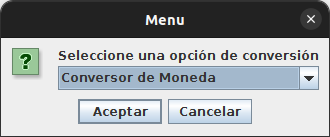

A continuación deberá seleccionar la divisa que quiere convertir.

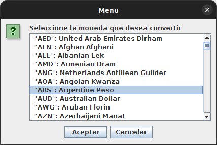

Luego seleccione el valor de dicha divisa.

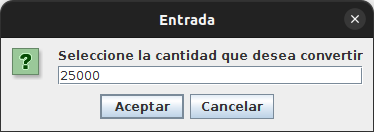

Seleccione la divisa para la conversión.

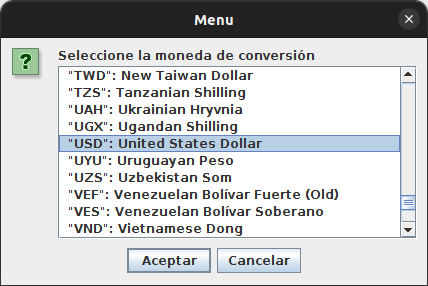

Aparecerá una ventana con el resultado de la operación.

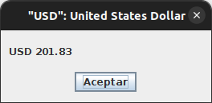

Si selecciona "Conversor de Temperatura":

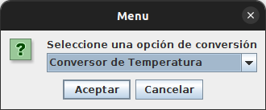

Deberá seleccionar la unidad que quiere convertir, tiene Celsius, Fahrenheit y Kelvin.

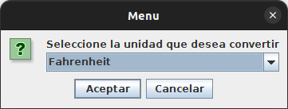

Luego el valor.

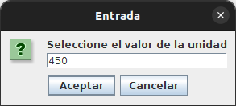

Seleccione la unidad para la conversión.

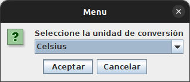

Finalmente le mostrará una ventana con el resultado.

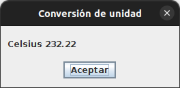

Indistintamente cuando termine cualquier operación, el programa le preguntará si desea realizar otra conversión.

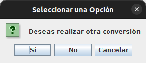

De aceptar empezara desde el principio para elegir una opción de conversión.
Caso contrario terminará el programa.

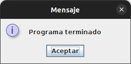